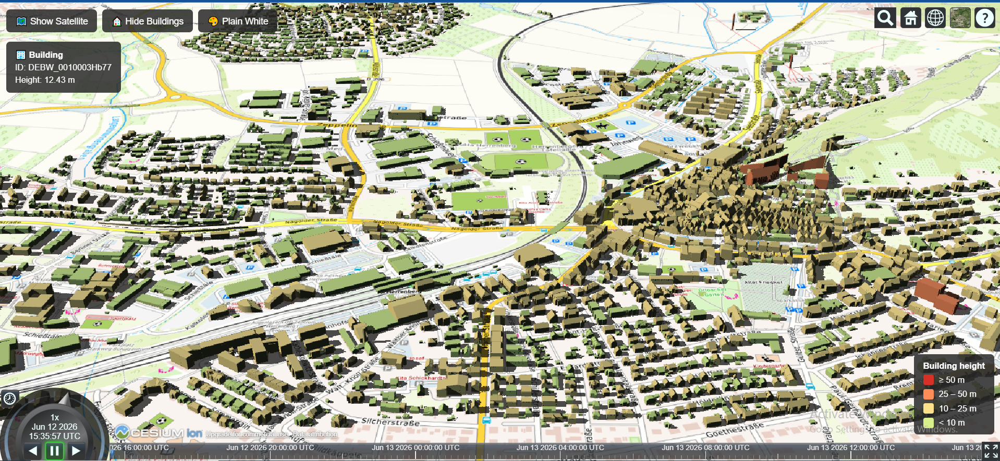

# 🌍 3D City Map - CesiumJS + Vite

An interactive 3D web map displaying real CityGML LoD2 buildings on a virtual globe.

**🔴 Live demo:** https://ashmeeradahal.github.io/my-3d-map/



## Features

- **3D buildings** — CityGML LoD2 dataset from the [Baden-Württemberg open geodata portal](https://opengeodata.lgl-bw.de/), converted to 3D Tiles with Cesium Ion and clamped to terrain
- **Cesium World Terrain** — buildings stand on real elevation data
- **WMS basemap** — switchable TopPlusOpen topographic map (© Bundesamt für Kartographie und Geodäsie)
- **Height-based coloring** — buildings colored by height, with a map legend
- **Building info on click** — shows the building ID and height from CityGML attributes
- **Real-time shadows** — drag the timeline to change the sun position

## Run locally

```bash
git clone https://github.com/Ashmeeradahal/my-3d-map.git
cd my-3d-map
npm install
npm run dev
```

Then open `http://localhost:5173/my-3d-map/`.

> **Note:** `src/main.js` requires a Cesium Ion access token and asset ID.

## Data sources & credits

- Building data: LoD2 CityGML, © LGL Baden-Württemberg, license dl-de/by-2-0
- Basemap: TopPlusOpen WMS, © Bundesamt für Kartographie und Geodäsie
- Terrain & imagery: Cesium Ion / Cesium World Terrain

*3D Web Mapping, 2026*